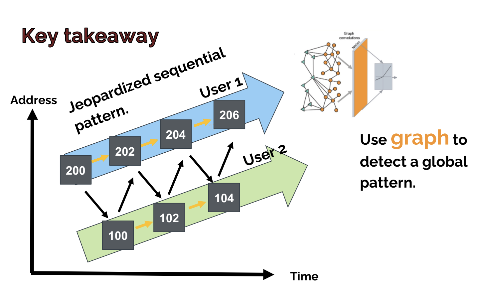
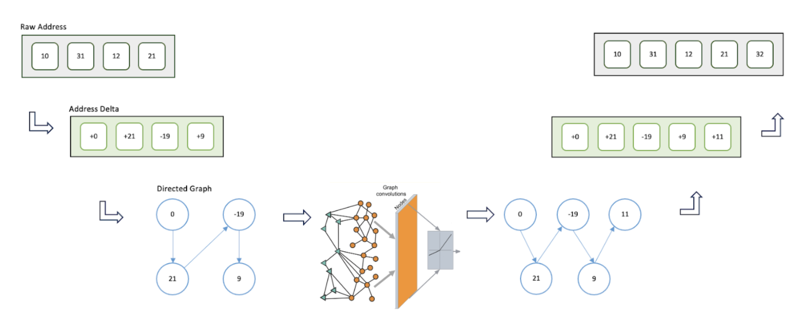
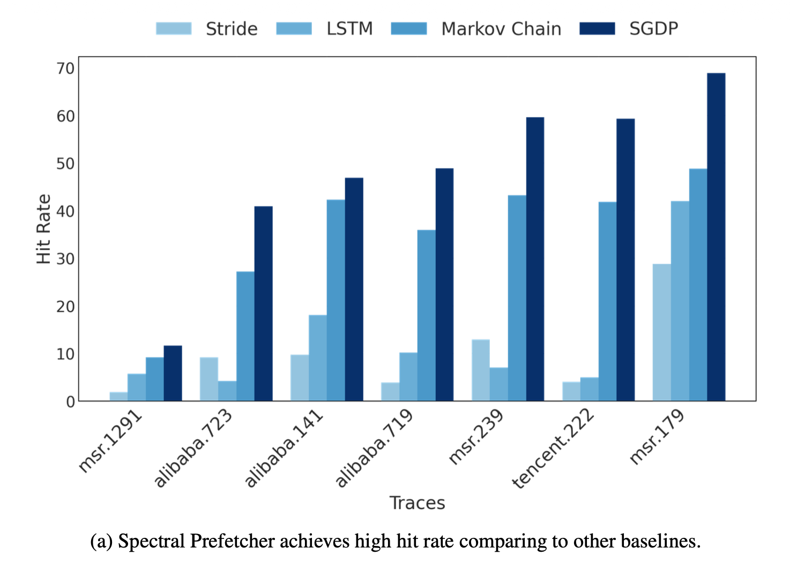
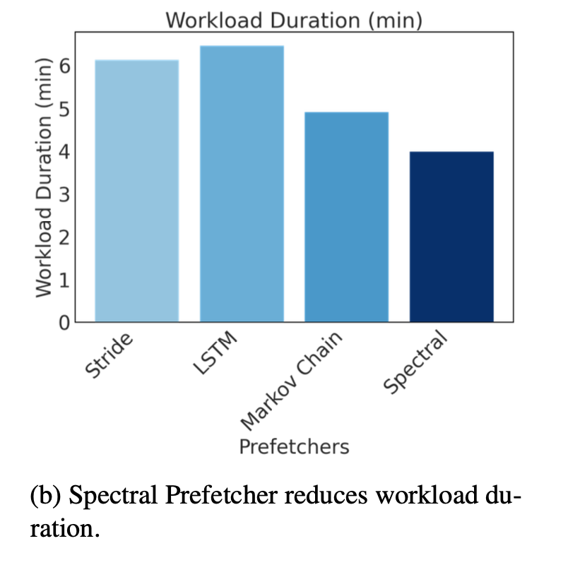

# Spectral Prefetcher: A Graph Neural Network-Based Storage Prefetcher

This repository contains the implementation of **Spectral Prefetcher**, a spectral graph neural network designed for rapid and precise I/O access pattern prediction in cloud storage systems. [Link to paper](./assets/GNN%20paper%20Zeyuan%20Yang%20and%20Daniar%20Kurniawan.pdf)


## 🏗️ Architecture

### Problem - Interleaved Access Pattern



Despite the widespread adoption of SSDs in cloud environments, I/O access (disk reads and writes) remains a significant performance bottleneck. To mitigate access latency, various prefetching techniques have been developed. However, as servers increasingly host multi-user workloads, the efficacy of traditional prefetchers diminishes. 

### Solution - Graph Neural Network to see a Global Picture



In this paper, we introduce **"Spectral Prefetcher"**, a spectral graph neural network for rapid and precise predictions. This approach:

- ✅ **21.8% improvement** in hit rate over baseline
- ✅ **79.9% reduction** in training and inference latency over state-of-the-art GNN prefetcher
- ✅ **33.3% decrease** in memory usage

## 📊 Results

### Figure 2: Hit Rate Comparison



Our experimental results demonstrate significant improvements in hit rate across various workloads:
- Microsoft Research Cambridge traces
- Alibaba cloud traces
- Seagate enterprise workloads

The Spectral Prefetcher (SGDP) consistently outperforms traditional prefetchers (Linux kernel prefetcher, LEAP) and other ML-based approaches (LSTM, spatial GNN).

### Figure 3: Performance Metrics



Comprehensive evaluation showing:
- **Training time**: 79.9% faster than baseline GNN
- **Memory footprint**: 33.3% reduction in model size

### Dataset: Microsoft Research Cambridge Traces

The traces were collected by Microsoft Research Cambridge from a data center of Microsoft Windows servers over a one-week period in February 2007 and can be downloaded from the SNIA IOTTA
repository:

Microsoft. MSR Cambridge Traces. http://iotta.snia.org/traces/388, 2022.


## 📖 Citation

If you use this code in your research, please cite:

```bibtex
@article{yang2024spectral,
  title={Leveraging AI for Faster Storage Access: a Graph-Neural-Network-Based Prefetcher},
  author={Yang, Zeyuan and Kurniawan, Daniar H.},
  journal={University of Chicago},
  year={2024}
}
```

## 👥 Authors

- **Zeyuan Yang** - University of Chicago - faradawny@gmail.com
- **Daniar H. Kurniawan** - University of Chicago - daniar@uchicago.edu

## 📝 License

This project is part of academic research at the University of Chicago.

---

For questions or issues, please contact faradawny@gmail.com
